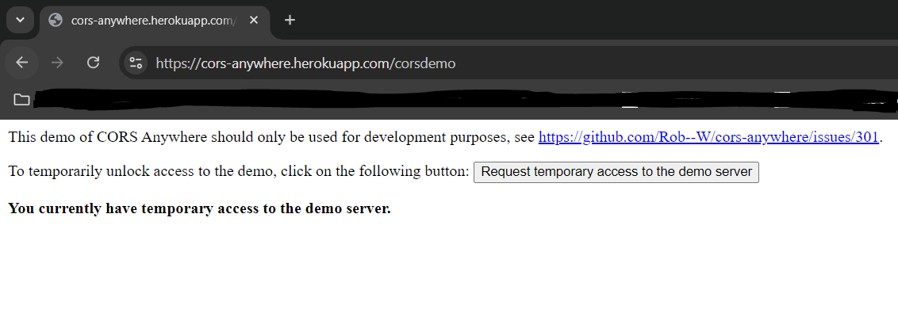

# Please read this documentation carefully!

Look at the [Nuxt 3 documentation](https://nuxt.com/docs/getting-started/introduction) to learn more.

## Installation

1. Clone the repository:

   ```bash
   git clone https://github.com/KaisarFS/mmob-blogs
   cd mmob-blogs or the downloaded repository
   ```

2. Make sure to install the dependencies:

   ```bash
   # npm
   npm install

   # pnpm
   pnpm install

   # yarn
   yarn install

   # bun
   bun install
   ```

3. Open this link https://cors-anywhere.herokuapp.com/corsdemo then click the `Request temporary access to the demo server` untill **`You currently have temporary access to the demo server`** showed up (you might need to click it more than 1).

   

   **IMPORTANT NOTES: if in the future the API error / status 200 but does not display anything / is affected by CORS again. then do the same as installation step 2.**

## Development Server

Start the development server on `http://localhost:3000`:

```bash
# npm
npm run dev

# pnpm
pnpm run dev

# yarn
yarn dev

# bun
bun run dev
```

## Production

Build the application for production:

```bash
# npm
npm run build

# pnpm
pnpm run build

# yarn
yarn build

# bun
bun run build
```

Locally preview production build:

```bash
# npm
npm run preview

# pnpm
pnpm run preview

# yarn
yarn preview

# bun
bun run preview
```

Check out the [deployment documentation](https://nuxt.com/docs/getting-started/deployment) for more information.
